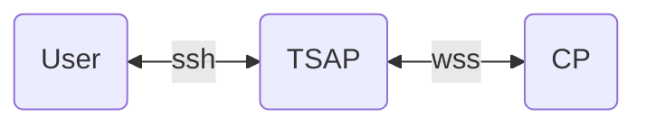
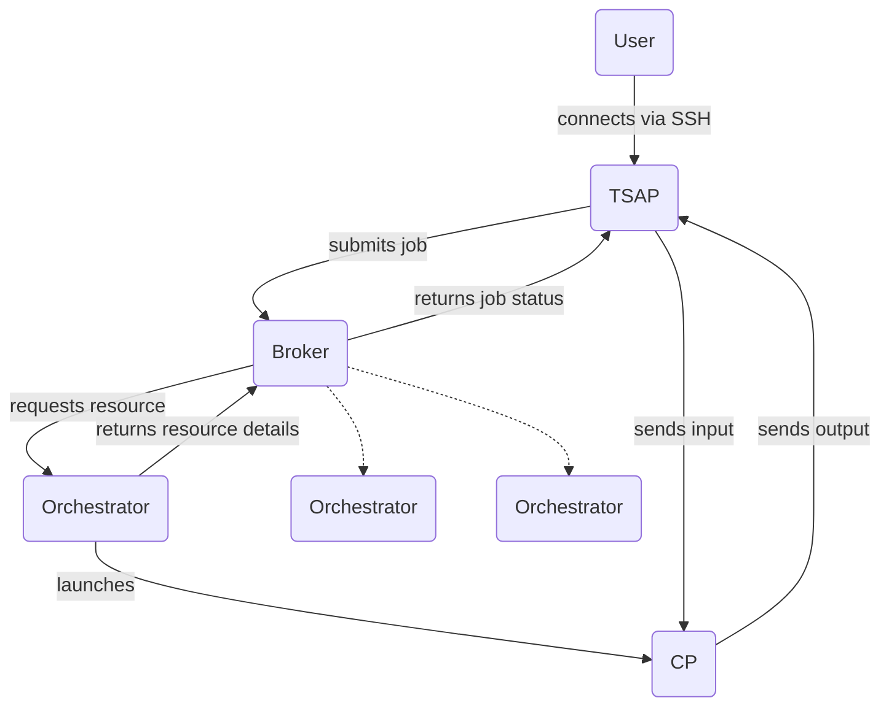

# Terminal Server

## Overview

1. User connects to Terminal Server Access Point (TSAP) via SSH
2. TSAP connects to the broker and submits a job, including any environment variables and commands provided by the user, whether it's an interactive session or not, etc.
3. Broker launches a Command Processor (CP) instance to process the job
4. Broker returns job status to TSAP, including CP connection details
5. TSAP connects to CP, and forwards any input from the user
6. CP returns any output it has to TSAP, which formats it for the user's terminal

The protocol used by the TSAP and CP to communicate with one another is intended to be terminal-agnostic and extensible.

For example, the display of a command-line prompt, and certain status information, is managed by the TSAP, based upon information sent in messages from the CP.

## Notes

1. There can be any number of TSAPs
2. TSAPs can exist for different transports (WebSockets, serial lines, etc.)
3. There's no requirement that the TSAP, Broker, Orchestrator, or CP are co-located on the same host or network, and the user need only access the TSAP
4. A Broker could use different kinds of orchestrator: a custom service, submitting to a Kubernetes cluster, submitting an AirFlow job, etc.
5. TSAPs may not necessarily be the only service submitting jobs to a Broker
6. Mutual TLS is used throughout
7. The CP-to-TSAP protocol is WebSocket-based, with packets (described below) sent as binary messages (opcode 2)
8. There's no particular reason why both Kerberos tickets and SSH agent sockets couldn't be forwarded to the CP

## Core protocol

All values in network byte order (MSB first). "Client" is the TSAP, "Server" is the CP.

* Packet ID (16 bits, 0..65535) NB. replies copy received packet ID
* Packet flags (8 bits, bitfield)
	* 0: 1 = REP Packet is a reply
	* 1: 2 =
		* [if #0 == 0] REQ Reply requested
		* [if #0 == 1] ACK Acknowledgement
	* 2: 4 = FIN Packet is complete
	* 3: 8 = [only when #0 == 1] ERR Error
* Packet Type (8 bits, 0..255) C = client sends, S = server sends
	* 0 = C  Hello
	* 1 = C  Line input
	* 2 =  S Plain text output
	* 3 =  S Set terminal state
* Packet payload (remainder)

### Hello packet

A hello packet is sent by the client to the server immediately upon connection. Its payload is a JSON object containing information about the user and the capabilities of the terminal.

A reply is always requested.

The reply payload is a JSON object whose format matches the "Set terminal state" payload (below).

### Line input packet

The payload of this packet is the text entered by the user, including any newlines.

If a reply is requested only an acknowledgement is sent (i.e., packet flags bits 0 and 1 are set, and no payload is included)

### Plain text output packet

The payload of this packet is the text output by the command processor. 

If a reply is requested only an acknowledgement is sent (i.e., packet flags bits 0 and 1 are set, and no payload is included)

### Set terminal state packet

The payload of this packet is a JSON object containing a set of terminal state values which should be updated.

Terminal state values are the mechanism by which:—

1. The server indicates that it'd ready to process commands
2. The server supplies information about itself which is displayed automatically by the client (subject to terminal type, configuration, context, etc.), such as the server time
3. The server updates the client's knowledge of session (presentation) state, such as the current prompt

If a reply is requested only an acknowledgement is sent (i.e., packet flags bits 0 and 1 are set, and no payload is included)
