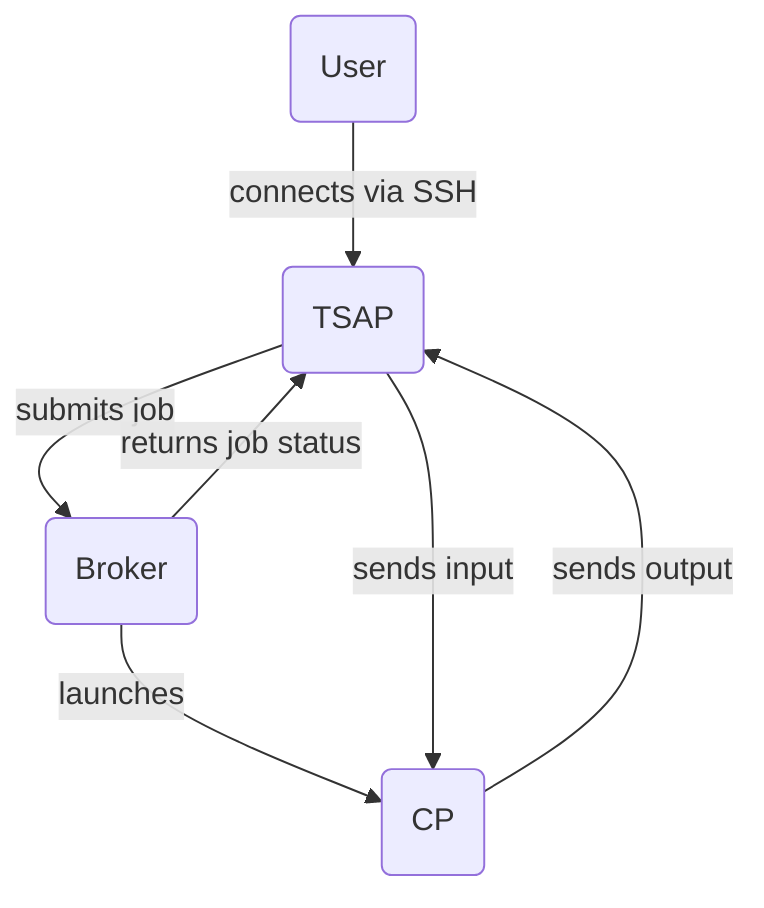

# Terminal Server

1. User connects to TSAP via SSH
2. TSAP connects to the broker and submits a job, including any environment variables and commands provided by the user, whether it's an interactive session or not, etc.
3. Broker launches a CP instance to process the job
4. Broker returns job status to TSAP, including CP connection details
5. TSAP connects to CP, and forwards any input from the user
6. CP returns any output it has to TSAP, which formats it for the user's terminal

The protocol used by the TSAP and CP to communicate with one another is intended to be terminal-agnostic and extensible. 

For example, the display of a command-line prompt, and certain status information, is managed by the TSAP, based upon information sent in messages from the CP.

